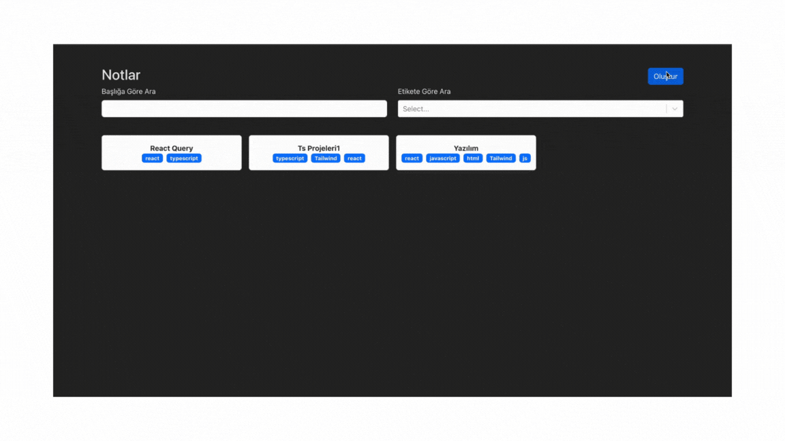

# Notes-App

## Kütüphaneler

* Proje, aşağıdaki kütüphaneleri kullanarak geliştirilmiştir:

- react-router-dom: React uygulamalarında istemci tarafı yönlendirmeleri (routing) yönetmek için kullanılır.
- react-bootstrap: Bootstrap bileşenlerini React bileşenleri olarak kullanmanıza olanak tanır.
- bootstrap: CSS framework'ü olup, responsive ve modern tasarımlar oluşturmak için kullanılır.
- react-markdown: Markdown içeriğini React bileşenleri olarak işlemek için kullanılır.
- react-select: Kullanıcı dostu, stilize edilmiş seçim menüleri oluşturmak için kullanılır.
- uuid: Evrensel olarak benzersiz kimlikler (UUID) oluşturmak için kullanılır.
- @types/uuid: UUID kütüphanesi için TypeScript tip tanımlamaları sağlar.
- npm install --save-dev @types/uuid

 # Notes-app
